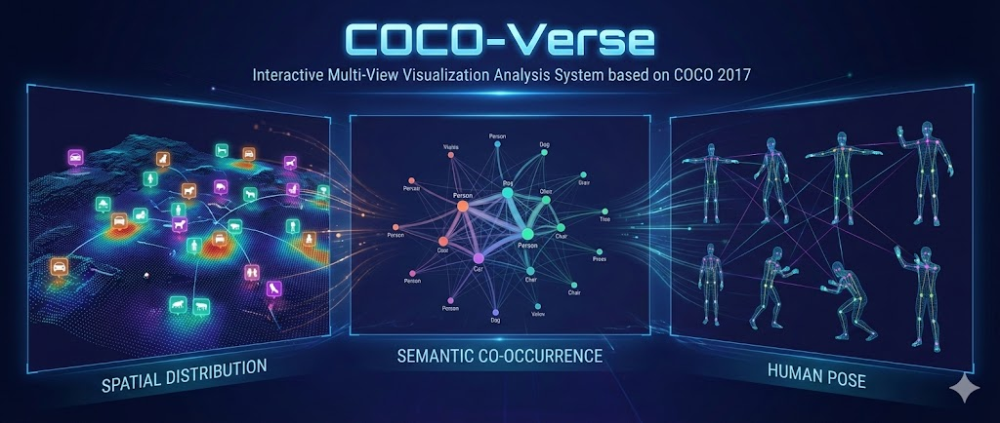
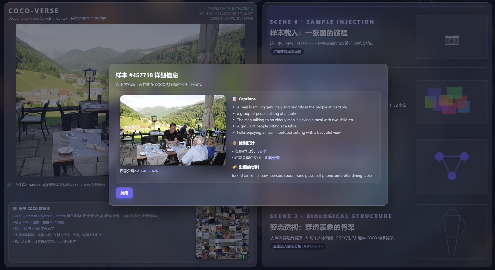
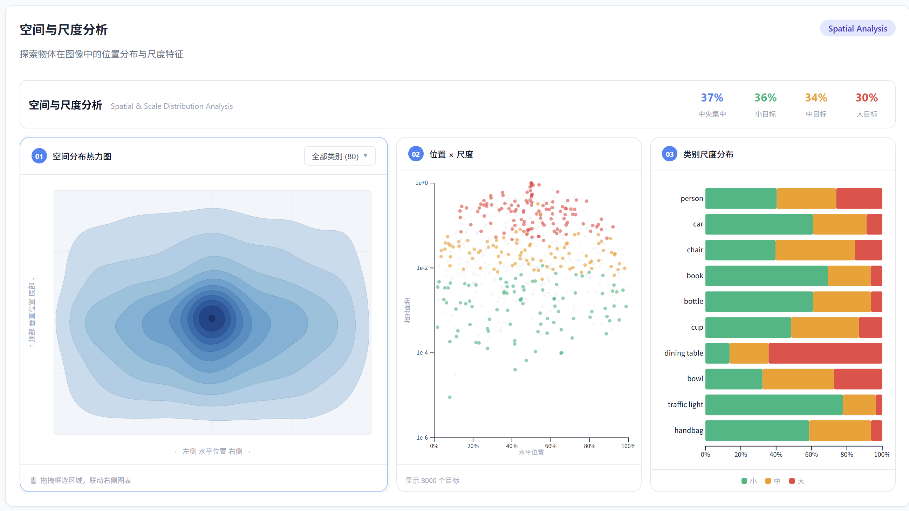
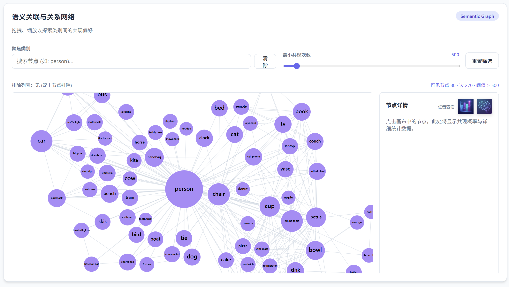
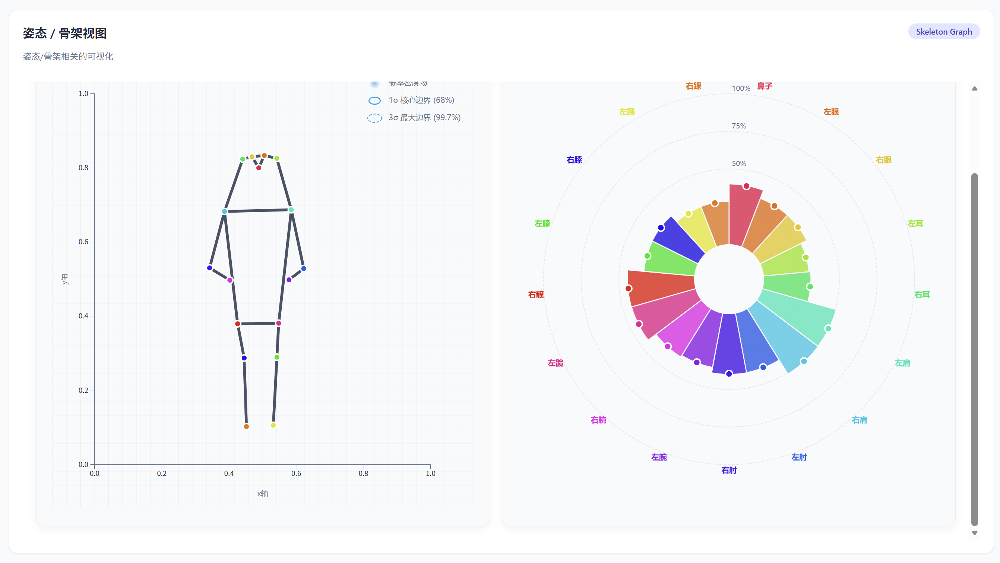
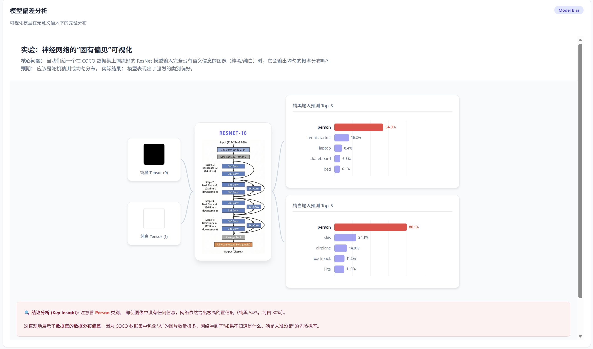
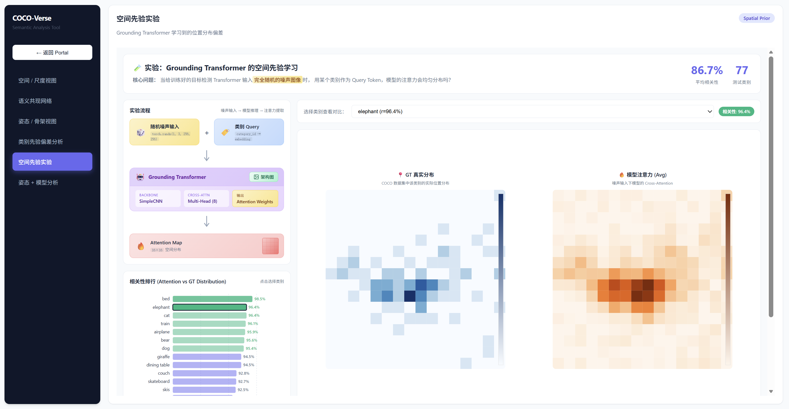
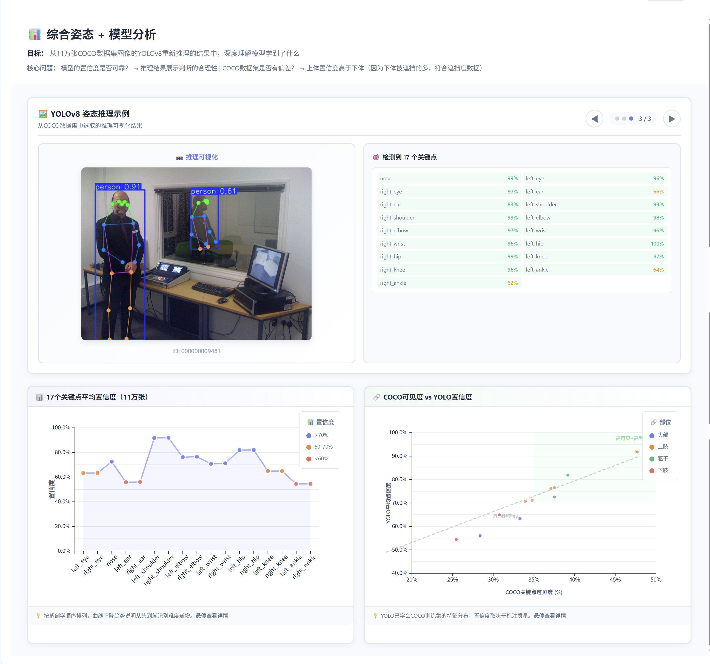

# 🌌 COCO-Verse：多视图可视化分析系统

<p align="center">
  
</p>

> **COCO-Verse** 是一个基于 COCO 2017 数据集的交互式多视图可视化分析系统，通过空间分布、语义共现、人体姿态三个维度，揭示视觉数据中的深层模式与洞察。

---

## 📋 目录

- [项目概述](#-项目概述)
- [功能特性](#-功能特性)
- [系统架构](#-系统架构)
- [快速开始](#-快速开始)
- [数据处理](#-数据处理)
- [视图详解](#-视图详解)
- [实验分析](#-实验分析)
- [技术栈](#-技术栈)
- [项目结构](#-项目结构)
- [常见问题](#-常见问题)
- [团队成员](#-团队成员)

---

## 🎯 项目概述

### 背景

COCO (Common Objects in Context) 是计算机视觉领域最具影响力的大规模数据集之一，包含：
- **123,287 张** 训练/验证图像
- **80 个** 物体类别
- **860,000+** 实例标注
- **250,000+** 人体关键点标注

### 目标

本项目旨在通过可视化分析，回答以下核心问题：

| 分析维度 | 核心问题 |
|----------|----------|
| **空间分布** | 不同类别的物体在图像中如何分布？大/中/小目标的空间偏好是什么？ |
| **语义共现** | 哪些物体经常同时出现？它们之间的条件概率关系如何？ |
| **人体姿态** | 人体关键点的可见性分布如何？不同场景下的典型姿态是什么？ |

---

## ✨ 功能特性

### 🏠 沉浸式门户 (Portal)

<p align="center">
  
</p>

**核心体验**：从单张真实样本出发，沉浸式引导用户进入数据分析世界

| 功能 | 说明 |
|------|------|
| 📜 **滚动叙事** | 4 个阶段（Intro → 空间 → 语义 → 姿态 → 进入），右侧卡片滚动触发场景切换 |
| 🎨 **双层视觉** | 背景层（hero_image 的分析叠加）+ 前景层（真实标注绘制） |
| 🖱️ **滚轮导航** | 在左侧主图区域使用鼠标滚轮可快速切换场景 |
| 🚀 **智能跳转** | CTA 按钮首次点击切换至对应场景，再次点击进入 Dashboard |
| ↩️ **返回入口** | 各 Dashboard 页面左上角提供"返回门户"按钮 |

**设计亮点**：
- 自适应布局：左右分栏比例 `1.3fr : 1fr`，在窄屏自动切换为单栏
- 场景状态同步：背景图、叠加层、统计数据、CTA 按钮随场景联动

---

### 📍 空间与尺度视图 (Spatial View)

<p align="center">
  
</p>

**三图联动分析**：揭示物体在图像中的空间分布规律

| 图表 | 可视化方式 | 交互 |
|------|------------|------|
| 🗺️ 等高线密度图 | 20×20 网格的中心点密度 | 类别切换高亮、Tooltip 显示密度值 |
| 📊 位置×尺度散点 | X=水平位置, Y=相对面积(log) | **Brush 框选** → 联动过滤其他图表 |
| 📈 尺度分布条形图 | 小/中/大目标堆叠百分比 | 悬停高亮、点击选中类别 |

**高级功能**：
- 🔍 **80 类下拉搜索**：支持模糊搜索全部 COCO 类别
- 🔗 **空间先验实验链接**：选中支持的类别时，显示"查看空间先验实验"按钮
- 📊 **实时统计面板**：显示当前筛选数据的目标数量、平均面积、尺度分布
- 📐 **响应式布局**：ResizeObserver 实时适配容器尺寸

---

### 🕸️ 语义共现网络 (Semantic View)

<p align="center">
  
</p>

**力导向图 + 条件概率分析**：探索物体类别之间的语义关联

| 功能 | 操作 | 效果 |
|------|------|------|
| 🎯 **节点锁定** | 单击节点 | 固定焦点，侧边栏显示条件概率 Top-N |
| 🚫 **节点排除** | 双击节点 | 从图中隐藏该类别，排除列表可恢复 |
| ✋ **节点拖拽** | 按住拖动 | 调整节点位置，力模拟自动适应 |
| 🔍 **缩放平移** | 滚轮/拖拽画布 | 探索大规模网络 |

**可视编码**：
- **节点大小** → 类别出现频次（对数映射）
- **节点颜色** → 超类别（12 种高区分度配色）
- **边粗细** → 共现次数
- **标签大小** → 自适应节点半径

**控制面板**：
- 🎚️ 共现阈值滑块：过滤低频共现边
- 🔄 重置按钮：恢复初始状态
- 📋 排除列表：管理已隐藏的节点

---

### 🦴 人体姿态视图 (Pose View)

<p align="center">
  
</p>

**双视角姿态分析**：概率骨架 + 雷达/散点图

| 图表 | 内容 | 交互 |
|------|------|------|
| 🦴 **概率骨架图** | 17 关键点 + 标准 COCO 骨架连接 | 悬停高亮、点击聚焦单个关键点 |
| 🕸️ **雷达/散点图** | 关键点可见性分布、COCO vs YOLO 对比 | 切换视图模式、联动高亮 |

**关键点分组配色**（按身体部位）：
- 🟣 **头部**：nose, eyes, ears
- 🟠 **上肢**：shoulders, elbows, wrists  
- 🟢 **躯干**：hips
- 🔴 **下肢**：knees, ankles

**高级功能**：
- 🔄 **身体部位筛选**：按头/上肢/躯干/下肢过滤显示
- 📊 **对称性分析**：对比左右侧关键点差异
- 🎯 **EventBus 联动**：与其他视图的关键点选择同步

---

### 🧪 模型偏差实验分析 (Model Bias Analysis)

<p align="center">
  
</p>

**神经网络的"固有偏见"可视化**

| 模块 | 内容 |
|------|------|
| 🖼️ **输入可视化** | 纯黑 Tensor `torch.zeros` / 纯白 Tensor `torch.ones` |
| 🏗️ **网络架构图** | ResNet-18 完整结构（可放大查看） |
| 📊 **预测概率** | 80 类别条形图，`person` 类标红突出 |
| ➡️ **流程箭头** | 贝塞尔曲线连接输入→网络→输出 |

**核心发现**：
- **纯黑输入** → `person` 置信度 **54.0%**
- **纯白输入** → `person` 置信度 **80.1%**
- 📖 **结论**：模型学习到了 COCO 数据集的类别先验分布

---

### 🔬 空间先验实验 (Spatial Prior Experiment)

<p align="center">
  
</p>

**Grounding Transformer 的空间注意力偏差分析**

| 图表 | 说明 |
|------|------|
| 📊 **相关性排行榜** | 77 类的 GT vs Attention 相关性，支持排序 |
| 🔥 **GT 热力图** | 真实数据集中该类别的空间分布 |
| 🔥 **注意力热力图** | 噪声输入下模型的注意力分布 |
| 🔥 **差异热力图** | 预测与真实的偏差可视化 |

**交互功能**：
- 🏷️ 点击排行榜条目 → 切换类别，更新热力图
- 🔗 从空间视图跳转 → 自动聚焦对应类别
- 🖼️ 热力图放大弹窗 → 查看细节

**关键指标**：
- 平均相关性：**86.7%**
- 最高相关性：**bed (98.5%)**

---

### 🎯 综合姿态 + 模型分析 (Pose Model Analysis)

<p align="center">
  
</p>

**YOLOv8 姿态检测深度分析**（基于 117,266 张图像推理结果）

| 模块 | 内容 | 交互 |
|------|------|------|
| 🖼️ **推理示例轮播** | 真实图片 + 骨架叠加 | 自动轮播、手动切换 |
| 📈 **关键点置信度曲线** | 17 点平均置信度趋势 | 悬停显示详情 |
| 📊 **可见性 vs 置信度散点** | COCO 标注可见性 vs YOLO 预测 | 按身体部位着色 |

**核心洞察**：
| 身体部位 | 平均置信度 | 原因分析 |
|----------|------------|----------|
| 头部/面部 | >90% | 特征明显，通常可见 |
| 上肢 | 70-90% | 动作多样但通常可见 |
| 下肢 | <60% | 遮挡较多（桌子、人群等） |

---

### 🎨 整体设计一致性

本系统采用统一的设计语言：

| 设计元素 | 规范 |
|----------|------|
| 🎨 **主色调** | Indigo (#6366f1) + Slate 灰阶 |
| 📐 **圆角** | sm=6px, md=10px, lg=14px |
| 🌑 **阴影** | 轻量级（0.05-0.06 透明度） |
| 📱 **响应式** | 所有图表支持 ResizeObserver 自适应 |
| 🖱️ **交互反馈** | 统一的 hover 动效、Tooltip 样式 |

---

## 🏗️ 系统架构

```
┌─────────────────────────────────────────────────────────────────────┐
│                   COCO-Verse System Architecture                    │
├─────────────────────────────────────────────────────────────────────┤
│                                                                     │
│   ┌──────────────┐      ┌──────────────┐      ┌──────────────┐      │
│   │    Portal    │      │  Dashboard   │      │ Cross-Filter │      │
│   │ (story_main) │ ──── │   (Views)    │ ──── │   (Events)   │      │
│   └──────────────┘      └──────────────┘      └──────────────┘      │
│          │                     │                     │              │
│          ▼                     ▼                     ▼              │
│   ┌─────────────────────────────────────────────────────────────┐   │
│   │                 D3.js Visualization Layer                   │   │
│   │  ┌─────────┐   ┌─────────┐   ┌─────────┐   ┌─────────┐      │   │
│   │  │ Contour │   │ Scatter │   │  Force  │   │Skeleton │      │   │
│   │  │ Density │   │  Plot   │   │  Graph  │   │  Pose   │      │   │
│   │  └─────────┘   └─────────┘   └─────────┘   └─────────┘      │   │
│   └─────────────────────────────────────────────────────────────┘   │
│                                │                                    │
│                                ▼                                    │
│   ┌─────────────────────────────────────────────────────────────┐   │
│   │                  Data Processing (Python)                   │   │
│   │  ┌───────────────┐  ┌────────────────┐  ┌───────────────┐   │   │
│   │  │process_spatial│  │process_semantic│  │ process_pose  │   │   │
│   │  └───────────────┘  └────────────────┘  └───────────────┘   │   │
│   └─────────────────────────────────────────────────────────────┘   │
│                                │                                    │
│                                ▼                                    │
│   ┌─────────────────────────────────────────────────────────────┐   │
│   │                  COCO 2017 Raw Data (JSON)                  │   │
│   │   instances_train2017.json  person_keypoints_train2017.json │   │
│   └─────────────────────────────────────────────────────────────┘   │
│                                                                     │
└─────────────────────────────────────────────────────────────────────┘
````

-----

## 🚀 快速开始

### 环境要求

  - **Node.js** \>= 14.0
  - **npm** \>= 6.0
  - **Python** \>= 3.7 (可选，仅用于复现数据处理)
  - **Pillow** (`pip install Pillow`, 可选，用于图像生成)

### 安装步骤

```bash
# 1. 克隆仓库
git clone [https://github.com/xzxxntxdy/Data-Visualization-Coursework.git](https://github.com/xzxxntxdy/Data-Visualization-Coursework.git)
cd Data-Visualization-Coursework

# 2. 安装 Node.js 依赖 (必需)
npm install

# 3. [可选] 数据复现
# ⚠️ 注意：项目已包含预处理好的 JSON 和图片数据，通常可跳过此步。
# 若需重新生成数据，请确保已下载 COCO 数据集并运行以下脚本：

# python find_image.py        # 生成 hero_image.jpg (门户主图) 和 hero_data.json
# python save_overview.py     # 生成 overview.jpg (门户背景概览)
# python process_semantic.py  # 生成 semantic_data.json
# python process_spatial.py   # 生成 spatial_data.json
# python process_pose.py      # 生成 pose_stats.json

# 4. 启动开发服务器
npm start
```

### 访问应用

打开浏览器访问 **http://localhost:8080**

-----

## 📊 数据处理

### 数据流程图

```text
COCO 原始数据 (JSON & 图片)        预处理脚本                  前端资源
──────────────────────          ────────────────           ──────────────
instances_train2017.json   ───▶  find_image.py      ───▶  hero_data.json
keypoints_train2017.json                                   hero_image.jpg 
COCO 图片集                                                 overview.jpg
──────────────────────           save_overview.py   
COCO 图片集                                                  
──────────────────────           process_spatial.py ───▶  spatial_data.json
instances_train2017.json                                    (8,000 采样)
──────────────────────           process_semantic.py───▶  semantic_data.json
instances_train2017.json                                    (80 类共现矩阵)
──────────────────────           process_pose.py    ───▶  pose_stats.json
person_keypoints_train2017.json                             (17 关键点统计)
```

### 数据文件说明

| 文件 | 实际大小 | 内容 | 用途 |
|------|----------|------|------|
| `hero_image.jpg` | ~214 KB | 筛选出的最佳图片 | 门户背景、故事叙事 |
| `hero_data.json` | ~17 KB | `hero_image` 的所有标注数据 | 门户叙事数据 |
| `overview.jpg` | ~537 KB | 随机采样的图片拼成的概览图 | 门户背景，展示数据集概貌 |
| `spatial_data.json` | ~2 MB | 8,000 条采样标注、80 类别统计 | 空间视图 |
| `semantic_data.json` | ~192 KB | 80×80 共现矩阵、条件概率 | 语义视图 |
| `pose_stats.json` | ~1.0 MB | 17 关键点可见性统计、骨架定义 | 姿态视图 |
| `spatial_prior_data.json` | ~9 KB | 77 个类别的空间先验数据 | 空间先验实验 |
| `pose_analysis_results.json` | ~25 KB | YOLOv8 姿态分析结果 | 姿态模型分析 |
| `coco_pose_results.json` | ~462 KB | YOLOv8 推理结果汇总 | 姿态模型分析 |
| `coco_vs_yolo_scatter.json` | ~7 KB | COCO 可见度 vs YOLO 置信度 | 散点图对比 |
| `blank_probs.json` | ~5 KB | 纯黑输入的模型预测 | 模型偏差实验 |
| `blank_probs_white.json` | ~5 KB | 纯白输入的模型预测 | 模型偏差实验 |

-----

## 📖 视图详解

### 1\. 空间与尺度视图

#### 可视映射

| 视觉通道 | 数据属性 |
|----------|----------|
| 等高线颜色深度 | 物体中心点密度 |
| 散点 X 坐标 | 归一化水平位置 (0\~1) |
| 散点 Y 坐标 | 相对面积 (对数刻度) |
| 散点颜色 | 尺度类别 (小/中/大) |
| 条形长度 | 各尺度类别占比 |

### 2\. 语义共现网络

#### 可视映射

| 视觉通道 | 数据属性 |
|----------|----------|
| 节点大小 | 类别出现频次 |
| 节点颜色 | 超类别 (supercategory) |
| 边粗细 | 共现次数 |
| 边透明度 | 共现强度 |

### 3\. 人体姿态视图

#### 可视映射

| 视觉通道 | 数据属性 |
|----------|----------|
| 关键点大小 | 可见性概率 |
| 关键点颜色 | 身体部位分组 |
| 骨架连线 | COCO 标准骨架定义 |
| 热力光晕 | 位置不确定性 |

-----

## 🔬 实验分析

本项目包含三个深度实验，探究深度学习模型从数据集中学到的隐性偏差：

### 1\. 模型偏差实验 (ResNet-18 类别先验)

**实验目的**：验证神经网络是否学习到了数据集的类别分布偏差

**实验设计**：
- 输入：完全无语义的纯色 Tensor（纯黑 `torch.zeros` / 纯白 `torch.ones`）
- 模型：在 COCO 多标签分类任务上训练的 ResNet-18
- 输出：80 个类别的预测概率

**关键发现**：
| 输入类型 | Person 预测概率 | 结论 |
|----------|-----------------|------|
| 纯黑 Tensor | 54.0% | 模型有强烈的 "人" 类先验 |
| 纯白 Tensor | 80.1% | 先验偏差更加明显 |

**意义**：揭示了 COCO 数据集中 "person" 类别占比过高导致的模型偏差

### 2\. 空间先验实验 (Grounding Transformer)

**实验目的**：验证目标检测 Transformer 是否学习到了类别的空间位置偏差

**实验设计**：
- 输入：随机噪声图像 `torch.randn(1, 3, 256, 256)`
- Query：各类别的 embedding
- 提取：Cross-Attention 权重，reshape 为 16×16 空间分布

**关键指标**：
| 指标 | 数值 |
|------|------|
| 平均相关性 | 86.7% |
| 测试类别数 | 77 |
| 最高相关性 (bed) | 98.5% |

**结论**：模型的注意力分布与 COCO 数据集的真实位置分布高度相关，证明 Transformer 学习到了空间先验

### 3\. 姿态模型分析 (YOLOv8 Pose)

**实验目的**：分析姿态检测模型在大规模数据上的表现规律

**数据规模**：
- 图像数量：117,266 张
- 人体实例：约 26 万个
- 关键点：17 个 COCO 标准关键点

**关键发现**：
| 身体部位 | 置信度特征 | 原因分析 |
|----------|------------|----------|
| 头部/面部 | 最高 (>90%) | 通常可见，特征明显 |
| 上肢 | 较高 (70-90%) | 动作多样但通常可见 |
| 下肢 | 最低 (<60%) | 遮挡较多（桌子、其他人等） |

-----

## 🛠️ 技术栈

### 前端

| 技术 | 版本 | 用途 |
|------|------|------|
| D3.js | ^7.4.4 | 核心可视化库 |
| d3-hexbin | ^0.2.2 | 六边形分箱 |
| Parcel | ^1.12.5 | 模块打包器 |

### 后端/数据处理

| 技术 | 用途 |
|------|------|
| Python 3 | 数据预处理脚本 |
| Pillow | 图像处理 (拼图/裁剪) |
| JSON | 数据交换格式 |

-----

## 📁 项目结构

```
Data-Visualization-Coursework/
│
├── 📄 package.json              # 项目配置
├── 📄 README.md                 # 项目说明（本文件）
├── 📄 PROJECT_STATUS.md         # 开发进度跟踪
│
├── � scripts/                  # 数据处理脚本
│   ├── 📁 preprocessing/        # 预处理脚本
│   │   ├── generate_story_img/  # 门户图片生成
│   │   └── process_coco_annotation/  # COCO 标注处理
│   ├── 📁 training/             # 模型训练相关
│   │   ├── class_bias_train/    # ResNet-18 类别偏差实验
│   │   └── grounding_train/     # Grounding Transformer 空间先验实验
│   └── 📁 yolo_analysis/        # YOLOv8 姿态分析
│
├── 📁 checkpoints/              # 模型权重文件
│   ├── coco_multilabel_resnet18.pth  # ResNet-18 多标签分类
│   ├── chair_transformer.pth         # Grounding Transformer
│   └── yolov8n-pose.pt               # YOLOv8 姿态模型
│
├── 📁 src/
│   ├── 📄 index.html            # 主页面（包含所有视图容器）
│   │
│   ├── 📁 js/
│   │   ├── story_main.js        # 门户滚动叙事
│   │   ├── spatial_view.js      # 空间视图模块
│   │   ├── semantic_graph.js    # 语义视图模块
│   │   ├── pose_view.js         # 姿态视图模块
│   │   ├── bias_view.js         # 模型偏差实验视图
│   │   ├── spatial_prior_view.js     # 空间先验实验视图
│   │   ├── pose_model_view.js        # 姿态模型综合视图
│   │   ├── pose_model_analysis.js    # 姿态模型分析视图
│   │   ├── image_explorer.js    # YOLOv8 推理示例浏览器
│   │   └── distribution_matrix.js    # 分布矩阵可视化
│   │
│   ├── 📁 data/
│   │   ├── instances_train2017.json      # COCO 实例标注（原始）
│   │   ├── person_keypoints_train2017.json # COCO 关键点标注（原始）
│   │   ├── hero_data.json                # 门户叙事数据
│   │   ├── hero_image.jpg / hero_pose.png / hero_semantic.png / hero_spatial.png
│   │   ├── overview.jpg                  # 门户背景概览图
│   │   ├── semantic_data.json            # 预处理：语义共现
│   │   ├── spatial_data.json             # 预处理：空间分布
│   │   ├── pose_stats.json               # 预处理：姿态统计
│   │   ├── spatial_prior_data.json       # 空间先验实验数据
│   │   ├── pose_analysis_results.json    # 姿态模型分析数据
│   │   ├── coco_pose_results.json        # YOLOv8 推理结果
│   │   ├── coco_vs_yolo_scatter.json     # COCO vs YOLO 对比数据
│   │   ├── blank_probs.json              # 纯黑输入预测
│   │   └── blank_probs_white.json        # 纯白输入预测
│   │
│   ├── 📁 visualized/           # YOLOv8 推理可视化图片
│   ├── 📁 network_img/          # 网络架构图
│   ├── 📁 bg/                   # 门户背景图
│   └── 📁 icon/                 # 静态图标资源
│
├── 📁 assets/                   # README 展示图片
│   ├── banner.png               # 项目横幅
│   ├── architecture.png         # 系统架构图
│   ├── portal_demo.png          # 门户演示截图
│   ├── spatial_view.png         # 空间视图截图
│   ├── semantic_view.png        # 语义视图截图
│   ├── pose_view.png            # 姿态视图截图
│   ├── 类别先验偏差分析.png       # 模型偏差实验截图
│   ├── 空间先验实验.png           # 空间先验实验截图
│   └── 综合姿态及模型分析.png     # 姿态模型分析截图
│
├── 📄 presentation.typ          # Typst 演示文稿
└── 📄 presentation.pdf          # 演示文稿 PDF
```

-----

## ❓ 常见问题

### 1\. 安装模块速度慢？

```bash
# 切换到国内镜像源
npm config set registry [https://registry.npmmirror.com](https://registry.npmmirror.com)
```

### 2\. 需要运行 Python 脚本吗？

**不需要**。项目中 `src/data/` 目录下已经包含了所有可视化所需的预处理数据（JSON 和 JPG）。Python 脚本仅供查阅数据处理逻辑或重新生成数据使用。

### 3\. 端口被占用？

修改 `package.json` 中的启动命令：

```json
"scripts": {
    "start": "parcel serve src/index.html --port 3000"
}
```

-----

## 👥 团队成员

| 成员 | 负责模块 |
|------|----------|
| 成员 A | 空间视图、数据处理 |
| 成员 B | 语义视图、交互设计 |
| 成员 C | 姿态视图、门户设计 |

-----

## 📜 许可证

本项目仅用于课程学习，数据来源于 [COCO Dataset](https://cocodataset.org/)。

-----

<p align="center">
  <b>COCO-Verse</b> · Decoding Common Objects in Context<br>
  Made with ❤️ for Data Visualization Course
</p>